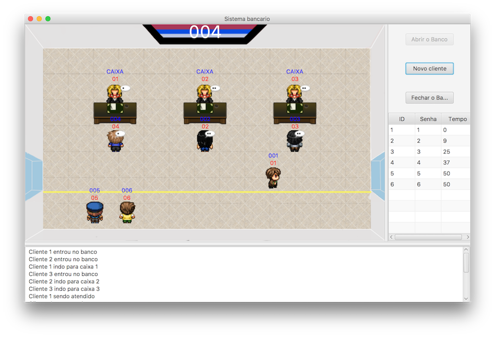

# Simulador-sistema-bancario

Implementação de semáforos para resolver uma variação do problema do barbeiro dorminhoco.

## Desenvolvedores
* Vítor Gomes Chagas | @Vitorvgc
* Edvaldo Junior | @EdyJunior

## Prévia

## Habilidades apresentadas

* Java + Threads + JavaFX
* Interface e Design Gráfico

## Uso

Para usar esse projeto:

* Clone o repositório;
* Instale o [JavaFX](https://docs.oracle.com/javafx/2/installation/jfxpub-installation.htm);
* Configure o JavaFX em sua IDE;
* Abra o projeto com a sua IDE;
* Execute o projeto;

## Contribuição

Contribuições são bem vindas. Sinta-se a vontade para mandar um pull request, caso queira contribuir.

## Licença

Este projeto possui licença MIT. Leia "LICENSE" para maiores informações.
